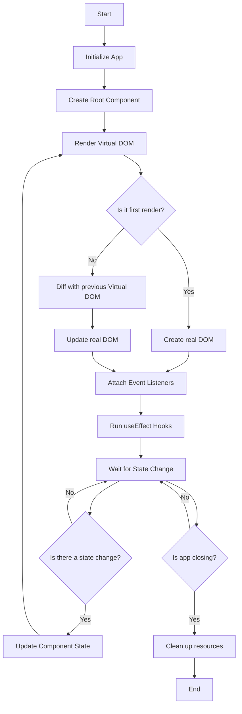

<p align="center">
  
</p>

# 🚀 GoWebComponents: Empower Your Web Development with Go

## Revolutionize Your Web Stack

GoWebComponents brings the power and simplicity of Go to full-stack web development. Combining React-like component architecture with Go's robustness, it offers a unique approach to building high-performance, type-safe web applications.

## 🌟 Why Choose GoWebComponents?

1. **Unified Full-Stack Development**: Write both frontend and backend in Go, reducing context switching and enabling seamless type sharing across the entire stack.
2. **Near-Native Performance**: Take advantage of WebAssembly’s performance, running Go code in the browser with speeds close to native execution for computationally heavy tasks.
3. **Strong Typing and Reliability**: Go’s robust type system helps catch errors at compile time, leading to more reliable and maintainable code.
4. **Concurrent UI Handling**: Efficiently manage multiple frontend operations with Go’s goroutines, ensuring smooth, responsive applications without the need for complex concurrency models.
5. **Memory Management with Garbage Collection**: Go’s built-in garbage collector optimizes memory usage in WebAssembly, simplifying memory management compared to manual handling in other languages.
6. **Simplified State Management**: Manage UI and application state directly in Go with a React-like API, eliminating the need for additional state management libraries.
7. **Enhanced Security with WASM**: WebAssembly’s sandboxed execution environment, combined with Go’s security features, provides an extra layer of protection against common web vulnerabilities.
8. **Consistent Development Experience**: Develop, debug, and maintain your entire application stack using Go, creating a streamlined development process and unified debugging experience.
9. **Fast Compilation and Deployment**: Benefit from Go’s quick compile times and its easy integration into WASM, speeding up development cycles and reducing iteration times.
10. **Familiar Component Model**: Utilize a React-like API in Go, easing the transition for developers familiar with React while leveraging Go’s simplicity and efficiency.

## 🏗️ Getting Started

### Installation

1. Ensure you have Go 1.22.0 or later installed.
2. Add GoWebComponents to your project:

   ```bash
   go get github.com/monstercameron/GoWebComponents@v1.1.0
   ```

3. Import in your Go files:

   ```go
   import "github.com/monstercameron/GoWebComponents/fiber"
   ```

### Key Functions

Here are the five most essential functions you'll use when building with GoWebComponents:

1. `createElement(typ interface{}, props map[string]interface{}, children ...interface{}) *Element`
   - Creates a virtual DOM element.
   - Use this to define the structure of your components.

2. `Text(content string) *Element`
   - Creates a text node in the virtual DOM.
   - Use this for adding text content within elements.

3. `useState[T any](initialValue T) (func() T, func(T))`
   - Manages state within a component.
   - Similar to React's useState, for creating and updating component-level state.

4. `useEffect(effect func(), deps []interface{})`
   - Handles side effects in components.
   - Similar to React's useEffect, for performing actions after render or on state changes.

5. `render(element *Element, container js.Value)`
   - Renders a component into a DOM container.
   - Typically used to mount the root component of your application.

### Quick Start: Todo List Application

Let's create a simple todo list to showcase GoWebComponents in action:

```go
package main

import (
	"fmt"
	"syscall/js"
	"github.com/monstercameron/GoWebComponents/fiber"
)

func main() {
	fmt.Println("Rendering TodoList")

	todoList := func(props map[string]interface{}) *fiber.Element {
		todos, setTodos := fiber.useState([]string{})
		newTodo, setNewTodo := fiber.useState("")

		handleInputChange := func() js.Func {
			return js.FuncOf(func(this js.Value, args []js.Value) interface{} {
				setNewTodo(args[0].Get("target").Get("value").String())
				return nil
			})
		}

		handleAddTodo := func() js.Func {
			return js.FuncOf(func(this js.Value, args []js.Value) interface{} {
				if newTodo() != "" {
					setTodos(append(todos(), newTodo()))
					setNewTodo("")
				}
				return nil
			})
		}

		return fiber.createElement("div", map[string]interface{}{"class": "container mx-auto p-4"},
			fiber.createElement("h1", map[string]interface{}{"class": "text-2xl font-bold mb-4"}, fiber.Text("Todo List")),
			fiber.createElement("input", map[string]interface{}{
				"type": "text", "value": newTodo(), "onchange": handleInputChange(),
				"class": "border rounded px-2 py-1 mr-2",
			}),
			fiber.createElement("button", map[string]interface{}{
				"onclick": handleAddTodo(),
				"class":   "px-4 py-2 bg-blue-500 text-white rounded hover:bg-blue-600",
			}, fiber.Text("Add Todo")),
			fiber.createElement("ul", map[string]interface{}{"class": "mt-4"},
				func() []interface{} {
					var items []interface{}
					for _, todo := range todos() {
						items = append(items, fiber.createElement("li", map[string]interface{}{"class": "mb-2"}, fiber.Text(todo)))
					}
					return items
				}()...),
		)
	}

	container := js.Global().Get("document").Call("getElementById", "root")
	fiber.render(fiber.createElement(todoList, nil), container)
}
```

This example demonstrates:
- State management with `useState`
- Event handling
- Dynamic rendering of list items
- Use of Tailwind CSS for styling

### Building and Running

1. Save the code in `main.go`
2. Build the WebAssembly binary:
   ```bash
   GOOS=js GOARCH=wasm go build -o static/bin/main.wasm
   ```
3. Serve the `static` directory with a web server
4. Open `index.html` in your browser to see your Todo List in action!

## 🗺️ Project Structure

```
GoWebComponents/
├── fiber/
│   ├── fiber.go        # Core framework code
│   └── fiber_examples.go  # Example components and applications
├── static/
│   ├── index.html      # Entry point for your app
│   ├── wasm_exec.js    # WebAssembly support
│   └── bin/
│       └── main.wasm   # Your compiled WebAssembly binary
├── scripts/
│   ├── build.sh        # Build script
│   └── pages.sh        # Deployment script for GitHub Pages
├── go.mod              # Go module file
└── README.md           # You are here!
```

## 🏗️ Architecture and Lifecycle

GoWebComponents leverages a virtual DOM approach, similar to React, but implemented entirely in Go. This architecture allows for efficient updates and renders, taking advantage of Go's performance characteristics.

### Application Lifecycle

The lifecycle of a GoWebComponents application follows these key stages:



### Technical Deep Dive

1. **Initialization**: 
   - The application starts by setting up the WebAssembly environment.
   - Go's runtime is initialized in the browser context.

2. **Component Creation**:
   - Components are defined as Go functions that return a virtual DOM structure.
   - The `createElement` function is used to build the component tree.

3. **Virtual DOM Rendering**:
   - The virtual DOM is a lightweight Go representation of the actual DOM.
   - It's efficiently diffed and patched to minimize actual DOM manipulations.

4. **State Management**:
   - State is managed using the `useState` hook, which returns a getter and setter.
   - State updates trigger re-renders of the affected components.

5. **Event Handling**:
   - Events are bound to Go functions using `js.FuncOf`.
   - These functions are kept alive to prevent garbage collection.

6. **Effect System**:
   - The `useEffect` hook allows for side effects and lifecycle management.
   - Effects are run after the DOM has been updated.

7. **WebAssembly Bridge**:
   - `syscall/js` is used to interface between Go and JavaScript.
   - DOM manipulation is done through this bridge, allowing Go code to interact with the browser environment.

8. **Reconciliation**:
   - When state changes occur, the virtual DOM is re-rendered.
   - A diffing algorithm determines the minimal set of changes needed to update the real DOM.

9. **Memory Management**:
   - Go's garbage collector handles memory management, including for DOM-related structures.
   - Care is taken to properly release JavaScript callbacks to prevent memory leaks.

10. **Performance Optimization**:
    - The use of WebAssembly allows for near-native performance for complex operations.
    - The virtual DOM approach minimizes costly DOM manipulations.

This architecture allows GoWebComponents to provide a React-like development experience while leveraging Go's strengths in performance, type safety, and concurrency.

## 🤝 Contributing

We welcome contributions! Here's how you can help:

1. Fork the repository
2. Create a feature branch: `git checkout -b feature/amazing-feature`
3. Commit your changes: `git commit -am 'Add amazing feature'`
4. Push to the branch: `git push origin feature/amazing-feature`
5. Open a pull request

Join us in shaping the future of web development with Go!

---

Embrace the power of Go for your entire web stack. With GoWebComponents, you're not just writing code; you're crafting efficient, scalable, and maintainable web applications. Start your journey with GoWebComponents today and experience the future of web development!