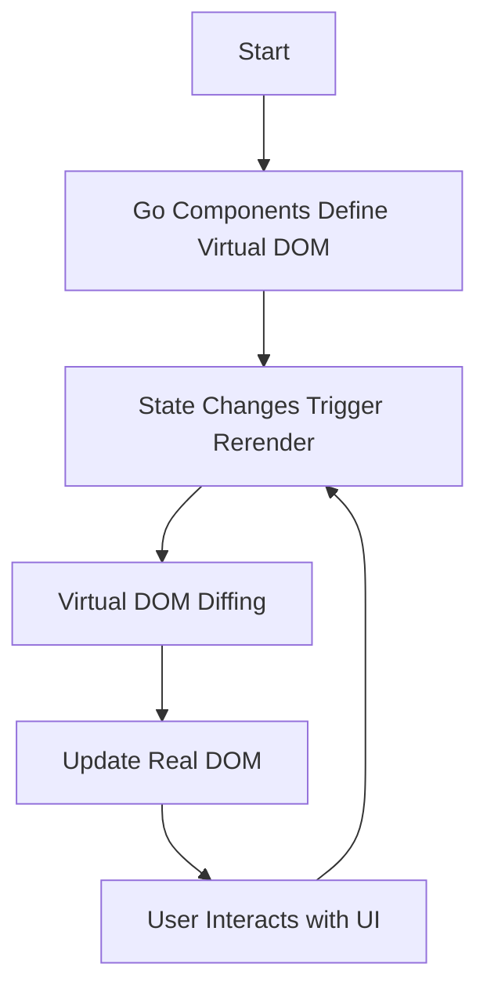

<p align="center">
  
</p>


# GoWebComponents – Craft Dynamic Web Apps with Go and WebAssembly

Welcome to **GoWebComponents**, an innovative framework for building dynamic, high-performance web applications using **Go** and **WebAssembly**. Leave behind the complexities of JavaScript frameworks and embrace the simplicity, speed, and safety of Go to create interactive UIs that run seamlessly in the browser.

---

## 🚀 Why Choose GoWebComponents?

- **Go Simplicity**: Leverage Go's clean syntax and powerful standard library to build web applications without the overhead of JavaScript.
- **WebAssembly Performance**: Achieve near-native execution speeds, making your applications fast and responsive.
- **Type Safety**: Benefit from Go's strong static typing, reducing runtime errors and increasing code reliability.
- **Lightweight Architecture**: No heavy dependencies or large build chains—just pure Go code compiled into efficient WebAssembly binaries.
- **Seamless State Management**: Manage application state directly in Go, simplifying data flow and UI updates.

---

## 🏗️ Project Structure

```plaintext
GoWebComponents/
├── components/
│   ├── component.go
│   ├── html.go
│   └── example.go
├── static/
│   ├── index.html
│   ├── script/
│   │   └── wasm_exec.js
│   └── bin/
│       └── main.wasm
├── scripts/
│   ├── build.sh
│   └── pages.sh
└── README.md
```

- **`components/`**: Contains the core Go files that define the component system, HTML rendering, and examples.
  - **`component.go`**: Manages component creation, state, and lifecycle.
  - **`html.go`**: Provides functions to create and manipulate virtual DOM nodes.
  - **`example.go`**: Contains example applications demonstrating how to use the framework.
- **`static/`**: Holds static assets like the HTML entry point and the compiled WebAssembly binary.
- **`scripts/`**: Contains build and deployment scripts for ease of use.

---

## 🔧 Architecture Overview

GoWebComponents utilizes a virtual DOM implemented in Go to efficiently update the browser's real DOM. Here's how it works:

1. **Component Creation**: Define components using Go functions that return a virtual DOM tree.
2. **State Management**: Use the `AddState` function to manage reactive state within components.
3. **Event Handling**: Attach Go functions to DOM events using the `Function` helper.
4. **Rendering**: The virtual DOM is diffed against the previous state to update only the necessary parts of the real DOM.
5. **WebAssembly Execution**: The Go code is compiled into WebAssembly, running directly in the browser with access to JavaScript APIs via `syscall/js`.

### 📊 Mermaid Diagram



---

## 🌟 Example 3: Building a Modern Calculator

In this example, we'll build a sleek, centered calculator application that performs basic arithmetic operations. We'll use Tailwind CSS for styling and demonstrate state management, event handling, and dynamic rendering—all in Go.

### 📝 Step-by-Step Tutorial

#### 1. **Prerequisites**

- **Go 1.18+**: Ensure you have Go installed on your system.
- **Browser with WebAssembly Support**: Most modern browsers support WebAssembly.
- **Tailwind CSS CDN**: We'll use the Tailwind CSS CDN for styling.

#### 2. **Project Setup**

Clone the repository and navigate to the project directory:

```bash
git clone https://github.com/monstercameron/GoWebComponents.git
cd GoWebComponents
```

#### 3. **Understanding the Code**

Open `components/example.go` and locate `Example3`:

```go
func Example3() {
    // Component code...
}
```

##### **Key Components**

- **State Management**: We use `AddState` to manage `input` and `result` states.
- **Event Handlers**: Functions like `handleButtonClick`, `handleEqual`, and `handleClear` manage user interactions.
- **Rendering**: The `RenderTemplate` function composes the UI using `Tag` and `Text` functions, mimicking HTML structure.

##### **UI Structure**

- **Display**: Shows the current input and previous expressions.
- **Buttons**: Number and operator buttons arranged in a grid layout.

##### **Tailwind CSS Styling**

- **Responsive Design**: The calculator is centered and scales well on different screen sizes.
- **Old-Timey Calculator Theme**: Uses monospaced fonts and a retro color scheme for the display.

#### 4. **Building the Application**

Use the provided `build.sh` script to compile the Go code into WebAssembly:

```bash
./scripts/build.sh
```

This script runs:

```bash
GOOS=js GOARCH=wasm go build -o static/bin/main.wasm
```

#### 5. **Running the Application**

Open `static/index.html` in your browser. Ensure the `wasm_exec.js` file is correctly referenced in the HTML file.

#### 6. **Testing the Calculator**

- **Basic Operations**: Click on numbers and operators to perform calculations.
- **Continuous Calculations**: After getting a result, you can continue calculating using the result as the new input.
- **Error Handling**: The calculator handles invalid inputs gracefully.

---

## 🔍 How It Works

### **State Management**

We manage calculator inputs and results using Go's variables and the `AddState` function:

```go
input, setInput := AddState(self, "input", "")
result, setResult := AddState(self, "result", "")
```

- **`input`**: Stores the current expression.
- **`result`**: Stores the evaluated result.

### **Event Handling**

Event handlers are defined using the `Function` helper:

```go
handleButtonClick := Function(self, "handleButtonClick", func(event js.Value) {
    value := event.Get("target").Get("innerText").String()
    newInput := *input + value
    setInput(newInput)
    setResult("")
})
```

- **Button Clicks**: Append the button value to the `input`.
- **Equal Sign**: Evaluate the expression and update `result`.

### **Rendering the UI**

The UI is composed using `Tag` and `Text` functions:

```go
RenderTemplate(self, Tag("div", Attributes{
    "class": "min-h-screen flex items-center justify-center bg-gray-100",
},
    // Calculator container
    Tag("div", Attributes{
        "class": "bg-white rounded-lg shadow-lg p-6",
    },
        // Display and buttons...
    ),
))
```

- **Tailwind CSS Classes**: Applied directly in the `class` attribute for styling.
- **Dynamic Content**: The `Text` function displays the current `input` and `result`.

### **Architecture Flow**

1. **User Interaction**: The user clicks a button.
2. **Event Handling**: The associated Go function updates the state.
3. **State Change**: The `setInput` or `setResult` functions update the state variables.
4. **Re-rendering**: The component re-renders, and the virtual DOM diffing algorithm updates the real DOM efficiently.

---

## 📦 How to Build and Deploy

### **Build the WebAssembly Binary**

Run the build script:

```bash
./scripts/build.sh
```

This compiles your Go code into `main.wasm`, the WebAssembly binary your browser can execute.

### **Deploying Locally**

Simply open `static/index.html` in your browser:

```bash
open static/index.html
```

### **Deploying to GitHub Pages**

Use the `pages.sh` script to build and deploy to GitHub Pages:

```bash
./scripts/pages.sh
```

#### **What the Script Does**

- **Builds** the WebAssembly binary with optimizations.
- **Commits** the changes.
- **Creates** or **switches** to the `gh-pages` branch.
- **Cleans** unnecessary files, keeping only the static assets.
- **Pushes** the changes to the `gh-pages` branch on GitHub.

---

## 🛠️ Scripts Explained

### **`build.sh`**

Compiles the Go code into WebAssembly:

```bash
GOOS=js GOARCH=wasm go build -o static/bin/main.wasm
```

### **`pages.sh`**

Automates the deployment to GitHub Pages:

- **Error Handling**: Checks after each command to ensure the process stops if an error occurs.
- **Branch Management**: Deletes any existing `gh-pages` branch and creates a new one.
- **File Management**: Moves static files to the root directory for GitHub Pages compatibility.

---

## 🤝 Contributing

Contributions are welcome! Feel free to submit issues or pull requests to improve the project.

---

## 📞 Contact

For any questions or suggestions, please reach out via GitHub issues.

---

Harness the power of Go and WebAssembly to build modern, high-performance web applications with GoWebComponents. Start coding your next big idea today!

---

# Appendix

## 🧩 Full Example Code: `Example3`

Here is the complete code for the calculator application:

```go
package components

import (
    "fmt"
    "syscall/js"
)

// Example3 creates a simple, modern, and centered calculator app using Tailwind CSS.
func Example3() {
    fmt.Println("Starting Example 3: Calculator App")

    // Create the component using the MakeComponent function
    component := MakeComponent(func(self *Component, props int, children ...*Component) *Component {
        // Initialize state for the calculator
        input, setInput := AddState(self, "input", "")
        result, setResult := AddState(self, "result", "")
        previousExpression, setPreviousExpression := AddState(self, "previousExpression", "")

        // Function to handle button clicks for numbers and operators
        handleButtonClick := Function(self, "handleButtonClick", func(event js.Value) {
            value := event.Get("target").Get("innerText").String()
            newInput := *input + value
            setInput(newInput)
            setResult("")
        })

        // Function to handle the equal button click
        handleEqual := Function(self, "handleEqual", func(event js.Value) {
            expr := *input
            res, err := jsEval(expr)
            if err != nil {
                setResult("Error")
            } else {
                setResult(res)
                setPreviousExpression(expr + " = " + res)
                setInput(res)
            }
        })

        // Function to handle the clear button click
        handleClear := Function(self, "handleClear", func(event js.Value) {
            setInput("")
            setResult("")
            setPreviousExpression("")
        })

        // Render the calculator UI
        RenderTemplate(self, Tag("div", Attributes{
            "class": "min-h-screen flex items-center justify-center bg-gray-100",
        },
            // Calculator container
            Tag("div", Attributes{
                "class": "bg-white rounded-lg shadow-lg p-6",
            },
                // Display for previous expression and current input
                Tag("div", Attributes{
                    "class": "mb-4",
                },
                    // Display the previous expression
                    Tag("div", Attributes{
                        "class": "text-right text-gray-500 text-sm",
                    }, Text(*previousExpression)),
                    // Display the input expression with old-timey calculator style
                    Tag("div", Attributes{
                        "class": "text-right text-green-500 text-3xl font-mono bg-gray-800 p-4 rounded",
                    }, Text(*input)),
                ),
                // Calculator buttons
                Tag("div", Attributes{
                    "class": "grid grid-cols-4 gap-4",
                },
                    // Buttons...
                ),
            ),
        ))

        // Return the component after rendering
        return self
    })

    // Insert the component into the DOM
    InsertComponentIntoDOM(component(0))
}

// jsEval evaluates a mathematical expression using JavaScript's eval function.
func jsEval(expr string) (string, error) {
    evalFunc := js.Global().Call("Function", "expr", "try { return eval(expr).toString(); } catch (e) { return 'Error'; }")
    res := evalFunc.Invoke(expr)
    resultStr := res.String()
    if resultStr == "Error" {
        return "", fmt.Errorf("error evaluating expression")
    }
    return resultStr, nil
}
```

---

## ⚠️ Important Notes

- **Security**: The `jsEval` function uses JavaScript's `eval`, which can be a security risk if not handled properly. In production, consider using a safe math expression parser.
- **Tailwind CSS**: Ensure that Tailwind CSS is included in your `index.html` via CDN or local build.
- **WebAssembly Support**: Not all browsers support WebAssembly; ensure you're using a compatible browser.

---

## 📚 Resources

- **Go Documentation**: [https://golang.org/doc/](https://golang.org/doc/)
- **WebAssembly Guide**: [https://webassembly.org/getting-started/developers-guide/](https://webassembly.org/getting-started/developers-guide/)
- **Tailwind CSS**: [https://tailwindcss.com/](https://tailwindcss.com/)

---

Thank you for exploring GoWebComponents! We hope this framework accelerates your web development process and inspires you to build amazing applications.