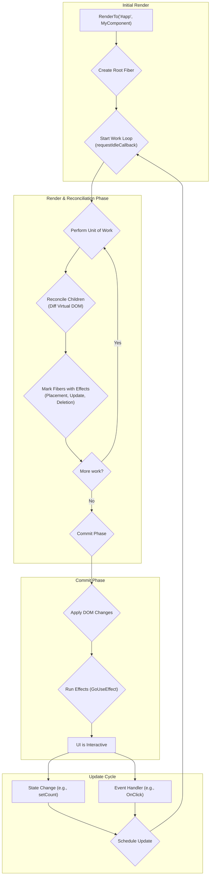

<p align="center">
  
</p>

# 🚀 GoWebComponents: Build Modern Web Apps with Go and WebAssembly

GoWebComponents is a modern frontend framework that lets you build fast, type-safe web applications using Go, compiled to WebAssembly. It offers a React-like development experience with hooks, a virtual DOM, and a rich set of tools, allowing you to write your entire stack in a single language.

## 🌟 Why GoWebComponents?

*   **A Truly Unified Stack**: Go beyond just using the same language. With GoWebComponents, you can share data structures, validation logic, and utility functions between your backend and frontend. This eliminates data-syncing bugs, reduces code duplication, and simplifies your entire development process. A single PR can introduce a new feature, from the database all the way to the UI.
*   **Next-Generation Performance**: Experience a faster web by default. Your Go code is compiled to a highly optimized WebAssembly binary that runs at near-native speed. We've engineered a fiber-based reconciliation algorithm that minimizes DOM updates, and our advanced memory pooling drastically reduces garbage collection pauses, leading to smoother animations and a more responsive UI.
*   **Superior Concurrency Model**: Say goodbye to a frozen UI. Unlike JavaScript's single-threaded event loop, Go provides true, simple concurrency with goroutines. You can run expensive operations—like processing large datasets, complex calculations, or real-time data streaming—in the background without ever blocking the main UI thread. This ensures your application remains fluid and interactive, no matter the workload.
*   **The Go Advantage Over JavaScript/TypeScript**: Leave the complexities of the JS ecosystem behind. With Go, you get a powerful and consistent standard library that minimizes external dependencies and a compiler that produces a single, portable binary. Say goodbye to `node_modules`, complex transpiler configurations, and the quirks of JavaScript. Write cleaner, more maintainable code that is fast by default.
*   **A Familiar, Modern API**: Leverage a powerful, React-like hook system (`GoUseState`, `GoUseEffect`, `GoUseMemo`) that makes managing state, side effects, and performance optimizations intuitive and straightforward.
*   **Comprehensive Component Library**: Build UIs with a rich set of over 80 pre-built HTML element constructors. From `Div` to `Button` to `Form`, everything you need is included.
*   **Rock-Solid Reliability**: Harness the power of Go's strong, static type system to catch errors at compile time, not in production. Write more robust and maintainable code with confidence.
*   **Effortless Data Fetching**: Simplify communication with your backend using the built-in `GoUseFetch` hook for declarative data fetching or the `GoFetch` function for imperative requests.

## 🏗️ Getting Started

### Prerequisites

*   Go 1.22.0 or later.
*   A Go project initialized with `go mod init`.

### Installation

Add GoWebComponents to your project:

   ```bash
   go get github.com/monstercameron/GoWebComponents@latest
   ```

### Quick Start: Your First Component

Here's how to create a simple "click counter" component.

1.  **Create `main.go`**:

```go
    // main.go
    package main

    import (
    	. "github.com/monstercameron/GoWebComponents/fiber"
    	"fmt"
    )

    func main() {
    	app := func(props Attrs) *Element {
    		count, setCount := GoUseState(0)
    
    handleClick := GoUseFunc(func(event GoEvent) {
    			setCount(count() + 1)
    		})

    		return Div(
    			Attrs{"class": "container"},
    			H1(nil, "Click Counter"),
    			P(nil, fmt.Sprintf("Current count: %d", count())),
    			Button(
    				Attrs{"onclick": handleClick},
    				"Click Me!",
    			),
    		)
    	}

        // Render the app component, which will be mounted to the element with the ID "app".
    	RenderTo("#app", app)

    	// Keep the Go program running to prevent it from exiting immediately.
    	select {}
    }
    ```

2.  **Create `index.html`**:

    ```html
    <!DOCTYPE html>
    <html lang="en">
    <head>
        <meta charset="UTF-8">
        <title>GoWebComponents Counter</title>
        <script src="wasm_exec.js"></script>
        <script>
            const go = new Go();
            WebAssembly.instantiateStreaming(fetch("main.wasm"), go.importObject).then((result) => {
                go.run(result.instance);
            });
        </script>
    </head>
    <body>
        <div id="app"></div>
    </body>
    </html>
    ```

3.  **Build and Run**:

    ```bash
    # Compile your Go code to WebAssembly
    GOOS=js GOARCH=wasm go build -o main.wasm main.go

    # You'll need wasm_exec.js from your Go installation
    cp "$(go env GOROOT)/misc/wasm/wasm_exec.js" .

    # Serve the files (e.g., using a simple server)
    # python -m http.server 8080
    ```

    Open `http://localhost:8080` in your browser to see your component in action!

## 📖 Core API

GoWebComponents provides a set of hooks to manage component state, side effects, and performance. Always import the library using a dot import (`.`) to have direct access to the API.

```go
import . "github.com/monstercameron/GoWebComponents/fiber"
```

### `GoUseState[T](initialValue T) (func() T, func(T))`

Manages state within a component. When you update the state, the component automatically re-renders.

*   **Returns**: A getter function to access the current state, and a setter function to update it.

**Note on Type Inference**: In most cases, you don't need to specify the generic type `[T]`. Go's type inference will automatically determine the type from the initial value you provide. For example, `GoUseState(0)` is automatically inferred as `GoUseState[int](0)`.

```go
// Go automatically infers the type from the initial value.
name, setName := GoUseState("World") // Type is inferred as string.
count, setCount := GoUseState(0)     // Type is inferred as int.

// Get the value
fmt.Printf("Hello, %s\n", name()) // -> "Hello, World"

// Set a new value (this will trigger a re-render)
setCount(count() + 1)
```

### `GoUseEffect(effect func(), deps []interface{})`

Runs side effects after the component has rendered. Ideal for fetching data, setting up subscriptions, or manipulating the DOM directly.

*   `effect`: The function to run.
*   `deps`: A slice of dependencies. The effect will only re-run if a value in this slice changes.
    *   `nil` or `[]interface{}{}`: Runs the effect once after the initial render.
    *   `omitted`: Runs after every render.

```go
// Runs once when the component mounts
GoUseEffect(func() {
    fmt.Println("Component has mounted!")
}, nil)

// Runs whenever 'userId' changes
userId, _ := GoUseState(1)
GoUseEffect(func() {
    fmt.Printf("Fetching data for user %d\n", userId())
}, []interface{}{userId()})
```

### `GoUseMemo(compute func() interface{}, deps []interface{}) interface{}`

Memoizes the result of an expensive calculation. The function only re-computes the value when one of its dependencies changes, preventing unnecessary work on each render.

```go
// An expensive calculation
fib := GoUseMemo(func() interface{} {
    return calculateFibonacci(number())
}, []interface{}{number()}).(int)
```

### `GoUseFunc(callback interface{}) js.Func`

Wraps a Go function to be used as a JavaScript event handler. It manages the lifecycle of the `js.Func` to prevent memory leaks.

```go
handleClick := GoUseFunc(func(event GoEvent) {
    fmt.Println("Button was clicked!")
    event.PreventDefault()
})

// In your component:
Button(Attrs{"onclick": handleClick}, "Click Me")
```

### `GoEvent`

The `GoEvent` struct is passed to event handlers and provides a safe, Go-friendly wrapper around the JavaScript event object.

*   `event.GetValue()`: Gets the `value` of an input element.
*   `event.IsChecked()`: Gets the `checked` state of a checkbox.
*   `event.GetKey()`: Gets the key pressed for keyboard events.
*   `event.PreventDefault()`: Prevents the browser's default action.
*   `event.StopPropagation()`: Stops the event from bubbling up.

## 🎨 HTML Elements

GoWebComponents provides functions for all standard HTML elements, allowing you to build your UI in a declarative way.

### Creating Elements

All element functions follow a similar pattern: `ElementName(attributes, children...)`.

```go
// A simple div with text
Div(nil, "Hello, World!")

// A div with a class and multiple children
Div(
    Attrs{"class": "container"},
    H1(nil, "My App"),
    P(nil, "This is a paragraph."),
)
```

### Attributes

Attributes are passed as an `Attrs` map (`map[string]interface{}`).

```go
// An input with type, placeholder, and an event handler
Input(Attrs{
    "type": "text",
    "placeholder": "Enter your name...",
    "oninput": GoUseFunc(handleInput),
})
```

### Common Elements

A short list of commonly used element functions:

*   `Div`, `Span`, `P`
*   `H1`, `H2`, `H3`, `H4`, `H5`, `H6`
*   `Button`, `Input`, `Form`, `Label`
*   `A` (for links), `Img` (for images)
*   `Ul`, `Ol`, `Li` (for lists)

## 🧩 Component Composition

You can build complex UIs by composing smaller, reusable components. This is the foundation of building a scalable application.

### Method 1: Direct Call (Composition by Value)

This is the most common and intuitive way to nest components. You simply call the component function within the parent, passing props and children as arguments.

Let's build a `ProfilePage` that uses a reusable `Card` component.

**`Card` Component**
A card that can take a title via props and render other elements inside it (children).

```go
// Card is a reusable component that displays content in a styled box.
func Card(props Attrs, children ...interface{}) *Element {
    // Set a default title, but allow it to be overridden by props.
    title := "Default Title"
    if props != nil && props["title"] != nil {
        title = props["title"].(string)
    }

    return Div(
        Attrs{"class": "card"}, // The outer container of the card
        H2(nil, title),          // The card title
        Div(
            Attrs{"class": "card-content"},
            children..., // Render any nested children here
        ),
    )
}
```

**`ProfilePage` Component**
Now, let's use the `Card` component inside a `ProfilePage`.

```go
// ProfilePage is a component that displays a user's profile.
func ProfilePage(props Attrs) *Element {
    return Div(
        Attrs{"class": "profile-page"},
        H1(nil, "User Profile"),

        // Example 1: A card with a specific title and a child paragraph.
        // This is a "direct call" to the Card component.
        Card(
            Attrs{"title": "About Me"},
            P(nil, "This is a simple profile page built with GoWebComponents."),
        ),

        // Example 2: A card using the default title (nil props) and multiple children.
        Card(
            nil, // Passing nil for props is perfectly fine.
            P(nil, "Here is another section of the profile."),
            Button(nil, "Contact Me"),
        ),
    )
}
```

### Method 2: Composition by Reference

For more dynamic scenarios, you can use helper functions like `DivWithComponents`. This allows you to pass component functions *by reference* and have the framework render them.

This is useful when the list of components to render is determined at runtime.

```go
// A simple Header component.
func Header(props Attrs) *Element {
    return Header(Attrs{"class": "main-header"}, H1(nil, "My Application"))
}

// A simple Footer component.
func Footer(props Attrs) *Element {
    return Footer(Attrs{"class": "main-footer"}, P(nil, "Copyright 2024"))
}

// A Layout component that renders other components by reference.
func AppLayout(props Attrs) *Element {
    // DivWithComponents takes a slice of component functions and renders them.
    // The components are passed by reference (e.g., Header, Footer), not called directly.
    return DivWithComponents(
        Attrs{"class": "layout"},
        Header, // Pass the function itself
        P(nil, "This is the main content of the page."),
        Footer, // Pass the function itself
    )
}
```

## 🔁 Component Lifecycle

GoWebComponents uses a fiber-based reconciliation algorithm, similar to React, to ensure efficient and predictable UI updates. The lifecycle is divided into two main phases: **Render/Reconciliation** and **Commit**.

1.  **Reconciliation Phase (Interruptible)**: When a render is triggered (either initially or from a state update), the framework builds a "work-in-progress" tree of fiber nodes representing the new UI state. It diffs this new tree with the existing one, figuring out the minimum set of changes needed. This phase can be interrupted by higher-priority work (like user input) to keep the UI responsive.
2.  **Commit Phase (Uninterruptible)**: Once the reconciliation is complete, the framework enters the commit phase. It applies all the calculated DOM changes in a single, synchronous sequence. It also runs any side effects defined in `GoUseEffect` hooks at this stage.

This entire process is designed to be non-blocking and to prioritize a smooth user experience.

Here is a visual representation of the lifecycle:


```mermaid
graph TD
    subgraph "Initial Render"
        A["RenderTo('#app', MyComponent)"] --> B{"Create Root Fiber"};
        B --> C{"Start Work Loop<br/>(requestIdleCallback)"};
    end

    subgraph "Render & Reconciliation Phase"
        C --> D{"Perform Unit of Work"};
        D --> E{"Reconcile Children<br/>(Diff Virtual DOM)"};
        E --> F{"Mark Fibers with Effects<br/>(Placement, Update, Deletion)"};
        F --> G{"More work?"};
        G -- Yes --> D;
        G -- No --> H{"Commit Phase"};
    end
    
    subgraph "Commit Phase"
        H --> I{"Apply DOM Changes"};
        I --> J{"Run Effects (GoUseEffect)"};
        J --> K[UI is Interactive];
    end

    subgraph "Update Cycle"
        L["State Change (e.g., setCount)"] --> M{"Schedule Update"};
        N["Event Handler (e.g., OnClick)"] --> M;
        M --> C;
    end

    K --> L & N;
```

## 🌐 Data Fetching

GoWebComponents provides two ways to fetch data: a declarative hook (`GoUseFetch`) for use inside components and an imperative function (`GoFetch`) for use anywhere in your application.

### Declarative: `GoUseFetch`

The `GoUseFetch` hook is the recommended way to handle data fetching inside your components. It automatically manages loading, error, and data states, and will re-fetch when the URL changes.

**Signature**

```go
GoUseFetch(url string, options ...FetchOptions) (func() FetchState, func())
```

*   **Returns**:
    1.  A `getter` function that returns the current `FetchState`.
    2.  A `refetch` function to manually trigger the fetch again.

*   **`FetchState` struct**:
```go
    type FetchState struct {
        Data    interface{}
        Loading bool
        Error   string
    }
    ```

**Example: Displaying User Data**

```go
func UserProfile(props Attrs) *Element {
    // The hook returns a getter and a refetch function.
    fetchState, refetch := GoUseFetch("https://api.example.com/users/1")
    
    // Call the getter to get the current state.
    state := fetchState()

    if state.Loading {
        return P(nil, "Loading user profile...")
    }

    if state.Error != "" {
        return Div(nil,
            P(nil, "Error: ", state.Error),
            Button(Attrs{"onclick": GoUseFunc(func(e GoEvent) { refetch() })}, "Retry"),
        )
    }

    // Type-assert the data to access its fields.
    user := state.Data.(map[string]interface{})

    return Div(Attrs{"class": "user-profile"},
        H1(nil, "User Profile"),
        P(nil, "Name: ", user["name"].(string)),
        P(nil, "Email: ", user["email"].(string)),
    )
}
```

### Imperative: `GoFetch`

The `GoFetch` function allows you to perform an HTTP request from anywhere, such as inside an event handler or a goroutine. It returns a channel that will receive the result.

**Signature**

```go
GoFetch(url string, options FetchOptions) <-chan FetchResult
```

*   **Returns**: A read-only channel (`<-chan`) that will deliver a single `FetchResult`.
*   **`FetchResult` struct**:
```go
    type FetchResult struct {
        Data interface{}
        Err  error
    }
    ```

**Important**: After you receive the result from the channel, you **must** return the channel to a pool using `ReturnFetchChannel(ch)` to prevent memory leaks.

**Example: Creating a User on Form Submit**

```go
func CreateUserForm(props Attrs) *Element {
    name, setName := GoUseState("")

    handleSubmit := GoUseFunc(func(e GoEvent) {
        e.PreventDefault()

        // Define the data to send.
        userData := map[string]interface{}{"name": name()}

        // Start the fetch operation.
        resultChan := GoFetch("https://api.example.com/users", FetchOptions{
            Method:  "POST",
            Headers: Attrs{"Content-Type": "application/json"},
            Body:    userData,
        })

        // Use a goroutine to wait for the result without blocking the UI.
        go func() {
            // Wait for the result from the channel.
            result := <-resultChan
            // IMPORTANT: Return the channel to the pool.
            ReturnFetchChannel(resultChan)

            if result.Err != nil {
                fmt.Println("Error creating user:", result.Err)
                // Here you would typically update state to show an error message.
            } else {
                fmt.Println("User created successfully:", result.Data)
                // Update state to show a success message or clear the form.
            }
        }()
    })

    return Form(Attrs{"onsubmit": handleSubmit},
        Input(Attrs{
            "type": "text",
            "value": name(),
            "oninput": GoUseFunc(func(e GoEvent) { setName(e.GetValue()) }),
        }),
        Button(nil, "Create User"),
    )
}
```

### `FetchOptions`

Both `GoUseFetch` and `GoFetch` accept an optional `FetchOptions` struct to customize the request.

```go
type FetchOptions struct {
    Method  string
    Headers map[string]interface{}
    Body    interface{} // Can be a string or a struct/map to be JSON-encoded.
}
```

## 📜 Examples

You can find more detailed examples in the [`/examples`](https://github.com/monstercameron/GoWebComponents/tree/master/examples) directory of this repository.

---

Happy Coding!

---

## 🚀 Ready to Build the Future of Web with Go?

You have the tools, the examples, and the power of Go at your fingertips. It's time to create fast, reliable, and modern web applications with GoWebComponents.

Clone the repository, run the examples, and start building your first component today.

```bash
go get github.com/monstercameron/GoWebComponents@latest
```

**Join the movement and happy coding!**