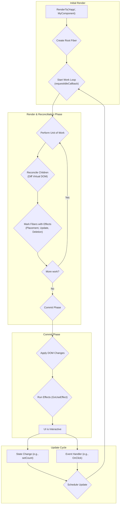

<p align="center">
  
</p>

# 🚀 GoWebComponents: Build Modern Web Apps with Go and WebAssembly

GoWebComponents is a modern frontend framework that lets you build fast, type-safe web applications using Go, compiled to WebAssembly. It offers a React-like development experience with hooks, a virtual DOM, and a rich set of tools, allowing you to write your entire stack in a single language.

## 🌟 Why GoWebComponents?

- **A Truly Unified Stack**: Go beyond just using the same language. With GoWebComponents, you can share data structures, validation logic, and utility functions between your backend and frontend. This eliminates data-syncing bugs, reduces code duplication, and simplifies your entire development process. A single PR can introduce a new feature, from the database all the way to the UI.
- **Next-Generation Performance**: Experience a faster web by default. Your Go code is compiled to a highly optimized WebAssembly binary that runs at near-native speed. We've engineered a fiber-based reconciliation algorithm that minimizes DOM updates, and our advanced memory pooling drastically reduces garbage collection pauses, leading to smoother animations and a more responsive UI.
- **Superior Concurrency Model**: Say goodbye to a frozen UI. Unlike JavaScript's single-threaded event loop, Go provides true, simple concurrency with goroutines. You can run expensive operations—like processing large datasets, complex calculations, or real-time data streaming—in the background without ever blocking the main UI thread. This ensures your application remains fluid and interactive, no matter the workload.
- **The Go Advantage Over JavaScript/TypeScript**: Leave the complexities of the JS ecosystem behind. With Go, you get a powerful and consistent standard library that minimizes external dependencies and a compiler that produces a single, portable binary. Say goodbye to `node_modules`, complex transpiler configurations, and the quirks of JavaScript. Write cleaner, more maintainable code that is fast by default.
- **A Familiar, Modern API**: Leverage a powerful, React-like hook system (`GoUseState`, `GoUseEffect`, `GoUseMemo`) that makes managing state, side effects, and performance optimizations intuitive and straightforward.
- **Comprehensive Component Library**: Build UIs with a rich set of over 80 pre-built HTML element constructors. From `Div` to `Button` to `Form`, everything you need is included.
- **Rock-Solid Reliability**: Harness the power of Go's strong, static type system to catch errors at compile time, not in production. Write more robust and maintainable code with confidence.
- **Effortless Data Fetching**: Simplify communication with your backend using the built-in `GoUseFetch` hook for declarative data fetching or the `GoFetch` function for imperative requests.

## 🏗️ Getting Started

### Prerequisites

- Go 1.22.0 or later.
- A Go project initialized with `go mod init`.

### Installation

Add GoWebComponents to your project:

```bash
go get github.com/monstercameron/GoWebComponents@latest
```

### Quick Start: Your First Component

Here's how to create a simple "click counter" component.

1.  **Create `main.go`**:

    ```go
    // main.go
    package main

    import (
    	"fmt"
    	"syscall/js"

    	"github.com/monstercameron/GoWebComponents/dom"
    	"github.com/monstercameron/GoWebComponents/hooks"
    	"github.com/monstercameron/GoWebComponents/render"
    )

    func main() {
    	// Define the component
    	app := func(props dom.Attrs) *render.Element {
    		count, setCount := hooks.UseState(0)

    		handleClick := hooks.GoUseFunc(func() {
    			setCount(count() + 1)
    		})

    		return dom.Div(
    			dom.Attrs{"class": "container"},
    			dom.H1(nil, dom.Text("Click Counter")),
    			dom.P(nil, dom.Text(fmt.Sprintf("Current count: %d", count()))),
    			dom.Button(
    				dom.Attrs{"onclick": handleClick},
    				dom.Text("Click Me!"),
    			),
    		)
    	}

        // Find the DOM container
        container := js.Global().Get("document").Call("getElementById", "app")
        if container.IsUndefined() || container.IsNull() {
            fmt.Println("❌ No element with id 'app' found!")
            return
        }

        // Create and render the element
        element := dom.CreateElement(app, nil)
        render.ToElement(element, container)

    	// Keep the Go program running to prevent it from exiting immediately.
    	select {}
    }
    ```

2.  **Create `static/index.html`**:

    ```html
    <!DOCTYPE html>
    <html lang="en">
      <head>
        <meta charset="UTF-8" />
        <title>GoWebComponents Counter</title>
        <script src="wasm_exec.js"></script>
        <script>
          const go = new Go();
          WebAssembly.instantiateStreaming(
            fetch("bin/main.wasm"),
            go.importObject
          ).then((result) => {
            go.run(result.instance);
          });
        </script>
      </head>
      <body>
        <div id="app"></div>
      </body>
    </html>
    ```

3.  **Manual Build and Run**:

    ```bash
    # Create directory structure
    mkdir -p static/bin

    # Compile your Go code to WebAssembly
    GOOS=js GOARCH=wasm go build -o static/bin/main.wasm main.go

    # You'll need wasm_exec.js from your Go installation
    cp "$(go env GOROOT)/misc/wasm/wasm_exec.js" static/

    # Serve the files (e.g., using a simple server)
    cd static && python -m http.server 8080
    ```

    Open `http://localhost:8080` in your browser to see your component in action!

## 🔥 Development with Live Reload

GoWebComponents includes a powerful **live reload development server** that dramatically improves your development experience with instant feedback, auto-rebuilding, and state preservation.

### ⚡ Quick Start Live Reload

**Linux/macOS:**

```bash
./scripts/livereload.sh
```

**Windows (PowerShell):**

```powershell
.\scripts\livereload.ps1
```

**Or run directly:**

```bash
cd scripts/livereload
go run livereload.go
```

### 🌟 Live Reload Features

#### 🔄 **Auto-Rebuild & Hot Reload**

- **Instant feedback**: Changes to `.go` files trigger automatic WASM rebuilds
- **Smart debouncing**: 2000ms debounce prevents excessive rebuilds during rapid editing
- **Process management**: Automatically kills running builds when new changes are detected
- **Build status**: Real-time build progress and error reporting via WebSocket

#### 🎯 **State Preservation**

- **Maintains scroll position** across reloads
- **Preserves component state** when possible
- **Custom state hooks**: Implement `exportAppState()` and `importAppState()` in your Go code
- **Session persistence**: State stored in browser sessionStorage

#### 📡 **WebSocket Communication**

- **Real-time updates**: Build status, errors, and reload notifications
- **Visual status indicator**: Top-right browser indicator shows connection and build status
- **Multiple client support**: Connect from multiple browser tabs simultaneously

#### 🎛️ **Smart File Watching**

- **Recursive directory watching**: Monitors your entire project
- **Intelligent filtering**: Only watches `.go` files, excludes `.git`, `vendor`, `node_modules`
- **Performance optimized**: Uses efficient filesystem notifications

### 🛠️ Advanced Live Reload Integration

For optimal development experience, implement these optional functions in your Go WASM application:

```go
// Export current application state for preservation
//go:export exportAppState
func exportAppState() js.Value {
    state := map[string]interface{}{
        "componentStates": getComponentStates(),
        "currentUser":     getCurrentUser(),
        "formData":        getFormData(),
        // Add your application-specific state
    }
    return js.ValueOf(state)
}

// Import and restore application state after reload
//go:export importAppState
func importAppState(jsState js.Value) {
    // Parse and restore your application state
    restoreComponentStates(jsState.Get("componentStates"))
    setCurrentUser(jsState.Get("currentUser"))
    restoreFormData(jsState.Get("formData"))
}

// Optional: Custom hot reload logic
//go:export hotReloadWasm
func hotReloadWasm() {
    // Perform hot reload without full page refresh
    // Re-initialize components while preserving state
    reInitializeComponents()
}
```

### 📊 Development Server Output

```
🔄 Live reload started. Watching for .go file changes...
📂 Watching directory: /your-project
⏱️  Debounce time: 2s
🌐 Server running on http://localhost:8080
🛑 Press Ctrl+C to stop

👀 Watching: /your-project/fiber
👀 Watching: /your-project/examples
🔨 Starting WASM build...
✅ Build completed successfully in 1.8s
🔌 WebSocket client connected (total: 1)

📝 File changed: /your-project/main.go
⏲️  Debouncing... will build in 2s
🔨 Starting WASM build...
✅ Build completed successfully in 1.2s
🔄 Hot reload triggered
```

### 🌐 Browser Experience

When you open `http://localhost:8080` with live reload:

- **🟢 Connection indicator**: Shows server connection status
- **⚡ Build progress**: Real-time build status and timing
- **🔄 Auto-refresh**: Seamless reloads when builds complete
- **💾 State preservation**: Your app state survives reloads
- **❌ Error display**: Build errors shown directly in browser

### ⚙️ Configuration

Customize the live reload server by modifying `scripts/livereload/livereload.go`:

```go
const (
    debounceTime      = 2000 * time.Millisecond // Debounce period
    quickDebounceTime = 500 * time.Millisecond  // Quick debounce
    maxDebounceTime   = 5000 * time.Millisecond // Maximum wait
    serverPort        = ":8080"                 // HTTP server port
)
```

## 📖 Core API

GoWebComponents provides a set of hooks to manage component state, side effects, and performance.

```go
import "github.com/monstercameron/GoWebComponents/hooks"
```

### `hooks.UseState[T](initialValue T) (func() T, func(interface{}))`

Manages state within a component. When you update the state, the component automatically re-renders.

- **Returns**: A getter function to access the current state, and a setter function to update it.

**Note on Type Inference**: In most cases, you don't need to specify the generic type `[T]`. Go's type inference will automatically determine the type from the initial value you provide. For example, `hooks.UseState(0)` is automatically inferred as `hooks.UseState[int](0)`.

```go
// Go automatically infers the type from the initial value.
name, setName := hooks.UseState("World") // Type is inferred as string.
count, setCount := hooks.UseState(0)     // Type is inferred as int.

// Get the value
fmt.Printf("Hello, %s\n", name()) // -> "Hello, World"

// Set a new value (this will trigger a re-render)
setCount(count() + 1)
```

### `hooks.UseEffect(effect func() func(), deps ...interface{})`

Runs side effects after the component has rendered. Ideal for fetching data, setting up subscriptions, or manipulating the DOM directly.

- `effect`: The function to run. It can return a cleanup function.
- `deps`: A variadic list of dependencies. The effect will only re-run if a value in this list changes.
  - `nil` or empty: Runs the effect after every render (if no deps passed).
  - Pass explicit dependencies to control re-runs.

```go
// Runs once when the component mounts (empty deps)
hooks.UseEffect(func() func() {
    fmt.Println("Component has mounted!")
    return nil
}, []interface{}{})

// Runs whenever 'userId' changes
userId, _ := hooks.UseState(1)
hooks.UseEffect(func() func() {
    fmt.Printf("Fetching data for user %d\n", userId())
    return nil
}, userId())
```

### `hooks.UseMemo(compute func() interface{}, deps ...interface{}) interface{}`

Memoizes the result of an expensive calculation. The function only re-computes the value when one of its dependencies changes, preventing unnecessary work on each render.

```go
// An expensive calculation
fib := hooks.UseMemo(func() interface{} {
    return calculateFibonacci(number())
}, number()).(int)
```

### `hooks.GoUseFunc(callback interface{}) interface{}`

Wraps a Go function to be used as a JavaScript event handler. It manages the lifecycle of the `js.Func` to prevent memory leaks and provides a cleaner API than `js.FuncOf`.

```go
handleClick := hooks.GoUseFunc(func(event js.Value) {
    fmt.Println("Button was clicked!")
    event.Call("preventDefault")
})

// In your component:
dom.Button(dom.Attrs{"onclick": handleClick}, dom.Text("Click Me"))
```

## 🎨 HTML Elements

GoWebComponents provides functions for all standard HTML elements, allowing you to build your UI in a declarative way.

```go
import "github.com/monstercameron/GoWebComponents/dom"
```

### Creating Elements

All element functions follow a similar pattern: `dom.ElementName(attributes, children...)`.

```go
// A simple div with text
dom.Div(nil, dom.Text("Hello, World!"))

// A div with a class and multiple children
dom.Div(
    dom.Attrs{"class": "container"},
    dom.H1(nil, dom.Text("My App")),
    dom.P(nil, dom.Text("This is a paragraph.")),
)
```

### Attributes

Attributes are passed as a `dom.Attrs` map (`map[string]interface{}`).

```go
// An input with type, placeholder, and an event handler
dom.Input(dom.Attrs{
    "type": "text",
    "placeholder": "Enter your name...",
    "oninput": hooks.GoUseFunc(handleInput),
})
```

### Common Elements

A short list of commonly used element functions:

- `dom.Div`, `dom.Span`, `dom.P`
- `dom.H1`, `dom.H2`, `dom.H3`, `dom.H4`, `dom.H5`, `dom.H6`
- `dom.Button`, `dom.Input`, `dom.Form`, `dom.Label`
- `dom.A` (for links), `dom.Img` (for images)
- `dom.Ul`, `dom.Ol`, `dom.Li` (for lists)

## 🧩 Component Composition

You can build complex UIs by composing smaller, reusable components. This is the foundation of building a scalable application.

### Method 1: Direct Call (Composition by Value)

This is the most common and intuitive way to nest components. You simply call the component function within the parent, passing props and children as arguments.

Let's build a `ProfilePage` that uses a reusable `Card` component.

**`Card` Component**
A card that can take a title via props and render other elements inside it (children).

```go
// Card is a reusable component that displays content in a styled box.
func Card(props dom.Attrs, children ...interface{}) *render.Element {
    // Set a default title, but allow it to be overridden by props.
    title := "Default Title"
    if props != nil && props["title"] != nil {
        title = props["title"].(string)
    }

    return dom.Div(
        dom.Attrs{"class": "card"}, // The outer container of the card
        dom.H2(nil, dom.Text(title)),          // The card title
        dom.Div(
            dom.Attrs{"class": "card-content"},
            children..., // Render any nested children here
        ),
    )
}
```

**`ProfilePage` Component**
Now, let's use the `Card` component inside a `ProfilePage`.

```go
// ProfilePage is a component that displays a user's profile.
func ProfilePage(props dom.Attrs) *render.Element {
    return dom.Div(
        dom.Attrs{"class": "profile-page"},
        dom.H1(nil, dom.Text("User Profile")),

        // Example 1: A card with a specific title and a child paragraph.
        // This is a "direct call" to the Card component.
        Card(
            dom.Attrs{"title": "About Me"},
            dom.P(nil, dom.Text("This is a simple profile page built with GoWebComponents.")),
        ),

        // Example 2: A card using the default title (nil props) and multiple children.
        Card(
            nil, // Passing nil for props is perfectly fine.
            dom.P(nil, dom.Text("Here is another section of the profile.")),
            dom.Button(nil, dom.Text("Contact Me")),
        ),
    )
}
```

### Method 2: Composition by Reference

For more dynamic scenarios, you can use helper functions like `dom.DivWithComponents` (if available, or just pass functions). This allows you to pass component functions _by reference_ and have the framework render them.

This is useful when the list of components to render is determined at runtime.

```go
// A simple Header component.
func Header(props dom.Attrs) *render.Element {
    return dom.Header(dom.Attrs{"class": "main-header"}, dom.H1(nil, dom.Text("My Application")))
}

// A simple Footer component.
func Footer(props dom.Attrs) *render.Element {
    return dom.Footer(dom.Attrs{"class": "main-footer"}, dom.P(nil, dom.Text("Copyright 2024")))
}

// A Layout component that renders other components by reference.
func AppLayout(props dom.Attrs) *render.Element {
    // You can pass component functions directly as children
    return dom.Div(
        dom.Attrs{"class": "layout"},
        Header, // Pass the function itself
        dom.P(nil, dom.Text("This is the main content of the page.")),
        Footer, // Pass the function itself
    )
}
```

## 🔁 Component Lifecycle

GoWebComponents uses a fiber-based reconciliation algorithm, similar to React, to ensure efficient and predictable UI updates. The lifecycle is divided into two main phases: **Render/Reconciliation** and **Commit**.

1.  **Reconciliation Phase (Interruptible)**: When a render is triggered (either initially or from a state update), the framework builds a "work-in-progress" tree of fiber nodes representing the new UI state. It diffs this new tree with the existing one, figuring out the minimum set of changes needed. This phase can be interrupted by higher-priority work (like user input) to keep the UI responsive.
2.  **Commit Phase (Uninterruptible)**: Once the reconciliation is complete, the framework enters the commit phase. It applies all the calculated DOM changes in a single, synchronous sequence. It also runs any side effects defined in `GoUseEffect` hooks at this stage.

This entire process is designed to be non-blocking and to prioritize a smooth user experience.

Here is a visual representation of the lifecycle:


```mermaid
graph TD
    subgraph "Initial Render"
        A["RenderTo('#app', MyComponent)"] --> B{"Create Root Fiber"};
        B --> C{"Start Work Loop<br/>(requestIdleCallback)"};
    end

    subgraph "Render & Reconciliation Phase"
        C --> D{"Perform Unit of Work"};
        D --> E{"Reconcile Children<br/>(Diff Virtual DOM)"};
        E --> F{"Mark Fibers with Effects<br/>(Placement, Update, Deletion)"};
        F --> G{"More work?"};
        G -- Yes --> D;
        G -- No --> H{"Commit Phase"};
    end

    subgraph "Commit Phase"
        H --> I{"Apply DOM Changes"};
        I --> J{"Run Effects (GoUseEffect)"};
        J --> K[UI is Interactive];
    end

    subgraph "Update Cycle"
        L["State Change (e.g., setCount)"] --> M{"Schedule Update"};
        N["Event Handler (e.g., OnClick)"] --> M;
        M --> C;
    end

    K --> L & N;
```

## 🌐 Data Fetching

GoWebComponents provides two ways to fetch data: a declarative hook (`fetch.UseFetch`) for use inside components and an imperative function (`fetch.Fetch`) for use anywhere in your application.

```go
import "github.com/monstercameron/GoWebComponents/fetch"
```

### Declarative: `fetch.UseFetch`

The `fetch.UseFetch` hook is the recommended way to handle data fetching inside your components. It automatically manages loading, error, and data states.

**Signature**

```go
fetch.UseFetch(url string, options ...fetch.Options) (func() fetch.State, func())
```

- **Returns**:

  1.  A `getter` function that returns the current `fetch.State`.
  2.  A `refetch` function to manually trigger the fetch again.

- **`fetch.State` struct**:
  ```go
  type State struct {
      Data    interface{}
      Loading bool
      Error   string
  }
  ```

**Example: Displaying User Data**

```go
func UserProfile(props dom.Attrs) *render.Element {
    // The hook returns a getter and a refetch function.
    fetchState, refetch := fetch.UseFetch("https://api.example.com/users/1")

    // Call the getter to get the current state.
    state := fetchState()

    if state.Loading {
        return dom.P(nil, dom.Text("Loading user profile..."))
    }

    if state.Error != "" {
        return dom.Div(nil,
            dom.P(nil, dom.Text("Error: " + state.Error)),
            dom.Button(dom.Attrs{"onclick": hooks.GoUseFunc(func() { refetch() })}, dom.Text("Retry")),
        )
    }

    // Type-assert the data to access its fields.
    // Note: fetch.Fetch currently returns Data as string (JSON), so you might need to unmarshal it.
    // For this example, we assume it's handled or we just display the raw string.
    userJson := state.Data.(string)

    return dom.Div(dom.Attrs{"class": "user-profile"},
        dom.H1(nil, dom.Text("User Profile")),
        dom.P(nil, dom.Text(userJson)),
    )
}
```

### Imperative: `fetch.Fetch`

The `fetch.Fetch` function allows you to perform an HTTP request from anywhere, such as inside an event handler or a goroutine. It returns a channel that will receive the result.

**Signature**

```go
fetch.Fetch(url string, options fetch.Options) <-chan fetch.Result
```

- **Returns**: A read-only channel (`<-chan`) that will deliver a single `fetch.Result`.
- **`fetch.Result` struct**:
  ```go
  type Result struct {
      Data interface{}
      Err  error
  }
  ```

**Example: Creating a User on Form Submit**

```go
func CreateUserForm(props dom.Attrs) *render.Element {
    name, setName := hooks.UseState("")

    handleSubmit := hooks.GoUseFunc(func(event dom.GoEvent) {
        event.PreventDefault()

        // Define the data to send.
        userData := map[string]interface{}{"name": name()}

        // Start the fetch operation.
        resultChan := fetch.Fetch("https://api.example.com/users", fetch.Options{
            Method:  "POST",
            Headers: map[string]interface{}{"Content-Type": "application/json"},
            Body:    userData,
        })

        // Use a goroutine to wait for the result without blocking the UI.
        go func() {
            // Wait for the result from the channel.
            result := <-resultChan

            if result.Err != nil {
                fmt.Println("Error creating user:", result.Err)
            } else {
                fmt.Println("User created successfully:", result.Data)
            }
        }()
    })

    return dom.Form(dom.Attrs{"onsubmit": handleSubmit},
        dom.Input(dom.Attrs{
            "type": "text",
            "value": name(),
            "oninput": hooks.GoUseFunc(func(event dom.GoEvent) {
                setName(event.GetValue())
            }),
        }),
        dom.Button(nil, dom.Text("Create User")),
    )
}
```

### `fetch.Options`

Both `fetch.UseFetch` and `fetch.Fetch` accept a `fetch.Options` struct to customize the request.

```go
type Options struct {
    Method  string
    Headers map[string]interface{}
    Body    interface{} // Can be a string or a struct/map to be JSON-encoded.
}
```

## 📜 Examples

You can find more detailed examples in the [`/examples`](https://github.com/monstercameron/GoWebComponents/tree/master/examples) directory of this repository.

---

## 🚀 Ready to Build the Future of Web with Go?

You have the tools, the examples, and the power of Go at your fingertips. It's time to create fast, reliable, and modern web applications with GoWebComponents.

Clone the repository, run the examples, and start building your first component today.

```bash
go get github.com/monstercameron/GoWebComponents@latest
```

**Join the movement and happy coding!**
