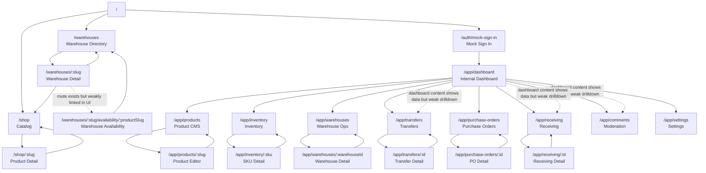

# Atlas Layout Map

This document traces the current Atlas Commerce OS site layout as it exists today, including the public storefront, the internal operations workspace, and the main interaction loops.

## Current Route Map

## Layout Model

### 1. Public Shell

- Global header nav: `/`, `/shop`, `/warehouses`
- Primary user flow: landing -> catalog -> product
- Secondary public flow: landing -> warehouses -> warehouse detail
- Hidden or weak public flow: warehouse detail -> warehouse availability

### 2. Internal Shell

- Entry gate: `/auth/mock-sign-in`
- Internal global nav:
  - `/app/dashboard`
  - `/app/products`
  - `/app/inventory`
  - `/app/warehouses`
  - `/app/transfers`
  - `/app/purchase-orders`
  - `/app/receiving`
  - `/app/comments`
  - `/app/settings`
- Most internal list pages open a single-item detail/editor route

## Interaction Map

### Public Interactions

- `/` is mostly a routing surface. It pushes users to `/shop` or `/warehouses`.
- `/shop` supports search and filtering, then links into `/shop/:slug`.
- `/shop/:slug` has the strongest action density:
  - quote request form
  - restock request form
  - product question form
  - links back toward catalog or warehouses
- `/warehouses` links into `/warehouses/:slug`.
- `/warehouses/:slug` explains the region, but currently sends users back to `/shop` more often than deeper into warehouse-specific inventory.
- `/warehouses/:slug/availability/:productSlug` exists, but it is not a prominent natural branch from the visible UI, so it reads like an orphaned route.

### Internal Interactions

- `/app/dashboard` is the entry point, but it behaves more like a static summary board than a command center.
- `/app/products` is now the clearest CRUD surface:
  - create product
  - open product editor
  - update product
  - delete product
- `/app/inventory` links to `/app/inventory/:sku`, but inventory management is still more threshold-oriented than full merchandising-oriented.
- `/app/warehouses`, `/app/transfers`, `/app/purchase-orders`, and `/app/receiving` each follow a list -> detail pattern.
- `/app/comments` and `/app/settings` are leaf routes with limited onward navigation beyond the header.

## Where The UX Goes In Circles

### Public loops

- `warehouse detail -> shop -> product -> warehouses` is easy to trigger, but it does not feel intentional.
- Warehouse pages do not strongly branch into product-specific warehouse availability, so users bounce back to catalog instead of continuing a warehouse-specific decision path.
- Product pages contain strong forms, but related-navigation structure is still shallow; users mostly go back to catalog instead of following a clear collection or recommendation path.

### Internal loops

- The dashboard suggests moderation, transfer, and receiving activity, but the cards shown there are not the strongest clickable drilldowns, so users often jump back to the top nav and re-enter another section manually.
- Product CMS and inventory are separate enough that a user can bounce between `/app/products` and `/app/inventory` without a clear “catalog item vs stock record” mental model.
- Comments and settings act like side rooms rather than connected workflow stages.

## Orphaned Or Weakly Connected Areas

- `/warehouses/:slug/availability/:productSlug` is structurally valid but under-linked.
- `/app/dashboard` does not yet behave like a real hub because summary cards do not consistently route into the exact underlying item.
- `/app/comments` has moderation actions, but it is not well connected to the storefront product routes or to a product-centric review queue.

## Practical Reading Of The Current Information Architecture

The current site is really two separate products sharing one shell:

- A public merchandising surface centered on catalog and product pages
- An internal operations surface centered on list/detail admin routes

The main confusion comes from the fact that the public warehouse routes and the internal dashboard both imply deeper continuation paths than the UI currently exposes.

## Recommended Simplified Mental Model

If you want to navigate the current site without getting lost, treat it like this:

- Public buying path: `/` -> `/shop` -> `/shop/:slug`
- Public logistics reference: `/warehouses` -> `/warehouses/:slug`
- Internal catalog management: `/app/products` -> `/app/products/:slug`
- Internal stock management: `/app/inventory` -> `/app/inventory/:sku`
- Internal logistics operations: `/app/warehouses`, `/app/transfers`, `/app/purchase-orders`, `/app/receiving`

## Main Problems To Fix Next

1. Make the dashboard a real router into underlying work, not just a summary screen.
2. Connect warehouse detail pages to actual warehouse-specific product availability links.
3. Add clearer collection / related-product / next-step paths on product detail pages.
4. Reduce the split-brain feel between product CMS and inventory management.
5. Turn comments and moderation into a product-linked workflow instead of an isolated queue.