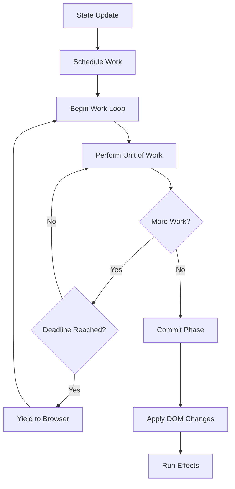

# Internal Package

**Location:** `/internal`

```
GoWebComponents/
├── dom/
├── hooks/
├── state/
├── render/
├── router/
├── fetch/
├── internal/         ← YOU ARE HERE
│   ├── platform/
│   │   ├── jsdom/
│   │   └── mockdom/
│   └── runtime/
│       ├── events.go
│       ├── hooks.go
│       ├── html.go
│       ├── interfaces.go
│       ├── reconciler.go
│       ├── runtime.go
│       ├── scheduler.go
│       ├── shim.go
│       ├── state.go
│       └── types.go
├── examples/
└── ...
```

## Overview

The `internal` package contains the core implementation details of GoWebComponents. This package is not meant to be imported directly by users - instead, use the public APIs in `/dom`, `/hooks`, `/state`, `/render`, `/router`, and `/fetch`.

## Architecture

### `/internal/runtime`

The runtime package implements the fiber-based reconciliation engine and hook system.

#### Key Components

**`reconciler.go`** - Fiber-based reconciliation algorithm

- Virtual DOM diffing
- Work-in-progress tree construction
- Effect tagging (Placement, Update, Deletion)
- Commit phase coordination

**`scheduler.go`** - Task scheduling and prioritization

- Work loop using `requestIdleCallback`
- Priority queue for updates
- Interruption and resumption of work
- Batching of state updates

**`hooks.go`** - Hook implementation

- `UseState` internal implementation
- `UseEffect` lifecycle management
- `UseMemo` memoization cache
- Hook state storage per fiber

**`state.go`** - Global state management

- Atom registry and subscriptions
- State update propagation
- Component re-render triggering

**`events.go`** - Event handling system

- Event delegation
- `GoEvent` wrapper implementation
- `js.Func` lifecycle management

**`types.go`** - Core data structures

- Fiber node structure
- Work-in-progress tree
- Effect lists
- Hook storage

**`interfaces.go`** - Internal interfaces

- Component function types
- Render targets
- Platform abstractions

**`shim.go`** - Compatibility layer

- Browser API abstractions
- Polyfills and fallbacks

**`html.go`** - HTML rendering logic

- Element creation
- Attribute setting
- DOM manipulation primitives

### `/internal/platform`

Platform-specific implementations for different environments.

#### `/internal/platform/jsdom`

Real DOM implementation for WebAssembly environment.

- Uses `syscall/js` to interact with browser DOM
- Actual DOM element creation and manipulation
- Event listener attachment

#### `/internal/platform/mockdom`

Mock DOM implementation for testing.

- Simulates DOM without browser
- Used in Go native tests
- Enables unit testing of components

## Fiber Architecture

### Fiber Node Structure

```
type Fiber struct {
    Type          string
    Props         map[string]interface{}
    StateNode     js.Value          // Actual DOM node
    Child         *Fiber            // First child
    Sibling       *Fiber            // Next sibling
    Return        *Fiber            // Parent fiber
    Alternate     *Fiber            // Previous version (for diffing)
    EffectTag     string            // "PLACEMENT", "UPDATE", "DELETION"
    Hooks         []Hook            // Hook state
    Index         int
}
```

### Reconciliation Process



### Work Loop Algorithm

1. **Render Phase** (Interruptible)

   - Walk the fiber tree
   - Reconcile children (diff algorithm)
   - Mark effects
   - Build work-in-progress tree

2. **Commit Phase** (Synchronous)
   - Traverse effect list
   - Apply DOM mutations
   - Call `UseEffect` hooks
   - Swap current tree with work-in-progress

## Hook System

### Hook State Storage

Hooks are stored in a linked list attached to each fiber:

```go
type Hook struct {
    State      interface{}
    Queue      []interface{}  // Pending state updates
    Deps       []interface{}  // Dependencies for effects/memo
    Cleanup    func()         // Cleanup function for effects
    Memoized   interface{}    // Cached value for UseMemo
}
```

### Hook Execution Order

Hooks must be called in the same order on every render to maintain state consistency:

```
Render 1: [UseState, UseEffect, UseMemo]
Render 2: [UseState, UseEffect, UseMemo]  ✅
Render 3: [UseState, UseMemo, UseEffect]  ❌ Wrong order!
```

## Event System

### Event Delegation

Events are delegated to the root container for performance:

```
Container (event listener)
└── Component Tree
    └── Button (virtual event handler)
```

When a button is clicked:

1. Event bubbles to container
2. Runtime identifies target fiber
3. Calls appropriate Go event handler
4. Prevents default if requested

### Memory Management

`js.Func` objects are released when:

- Component unmounts
- Event handler changes
- Effect cleanup runs

## Testing Infrastructure

### Mock DOM

The mock DOM allows testing components without a browser:

```go
// In test
func TestComponent(t *testing.T) {
    mockDOM := mockdom.New()

    element := MyComponent(nil)
    render.ToElement(element, mockDOM.Container)

    // Assert DOM structure
    assert.Equal(t, "div", mockDOM.GetElementType())
}
```

### Platform Abstraction

The platform interface enables swapping real DOM for mock DOM:

```go
type Platform interface {
    CreateElement(tagName string) DOMNode
    SetAttribute(node DOMNode, key string, value interface{})
    AppendChild(parent, child DOMNode)
    // ...
}
```

## Performance Optimizations

### Memory Pooling

Reuses fiber nodes and data structures to reduce GC pressure:

```go
var fiberPool = sync.Pool{
    New: func() interface{} {
        return &Fiber{}
    },
}

func acquireFiber() *Fiber {
    return fiberPool.Get().(*Fiber)
}

func releaseFiber(f *Fiber) {
    // Reset fiber
    fiberPool.Put(f)
}
```

### Batching

Multiple state updates in the same event are batched into a single render:

```go
handleClick := func() {
    setCount(count + 1)    // Batched
    setText("Updated")     // Batched
    setEnabled(true)       // Batched
    // Only one render triggered
}
```

### Priority Queue

High-priority updates (user input) can interrupt low-priority work:

```
Priority Levels:
1. Immediate (user input, clicks)
2. User-Blocking (animations, transitions)
3. Normal (data fetching results)
4. Low (off-screen content)
5. Idle (analytics, logging)
```

## Related Packages

- **[/dom](../dom/)** - Public API built on this runtime
- **[/hooks](../hooks/)** - Public hooks API
- **[/render](../render/)** - Public rendering API
- **[/state](../state/)** - Public state management API

## For Contributors

If you're contributing to GoWebComponents:

1. **Don't Break Public APIs**: Changes to `/internal` shouldn't affect public packages
2. **Add Tests**: All runtime changes need tests in `/internal/runtime/*_test.go`
3. **Document Algorithms**: Complex algorithms need inline comments
4. **Benchmark Changes**: Performance-critical code needs benchmarks

## Testing

Run internal tests:

```bash
go test ./internal/runtime/...
go test ./internal/platform/mockdom/...
```

Run benchmarks:

```bash
go test -bench=. ./internal/runtime/
```

## Documentation

This package is internal implementation only. For user-facing documentation, see:

- [Main README](../)
- [/dom](../dom/)
- [/hooks](../hooks/)
- [/render](../render/)
