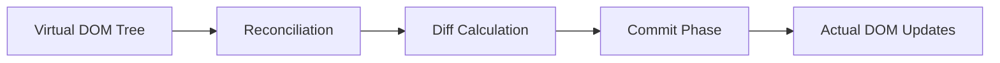
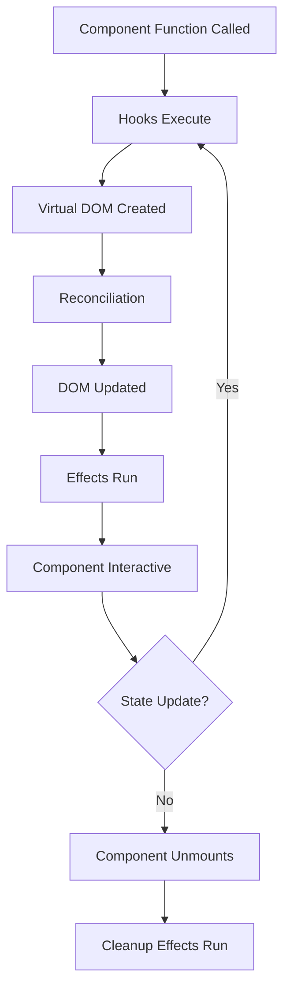

# Render Package

**Location:** `/render`

```
GoWebComponents/
├── dom/
├── hooks/
├── state/
├── render/           ← YOU ARE HERE
│   ├── doc.go
│   └── render.go
├── router/
├── fetch/
├── internal/
├── examples/
└── ...
```

## Overview

The `render` package is the core rendering engine for GoWebComponents. It takes virtual DOM elements created by the `dom` package and efficiently renders them to the actual browser DOM, managing updates through a fiber-based reconciliation system.

## Core Functions

### `ToElement(element *Element, container js.Value)`

Renders a virtual DOM element to a JavaScript DOM container.

```go
import (
    "syscall/js"
    "github.com/monstercameron/GoWebComponents/dom"
    "github.com/monstercameron/GoWebComponents/render"
)

func main() {
    // Create your component
    app := dom.Div(nil, 
        dom.H1(nil, dom.Text("Hello, World!")))
    
    // Get the container element
    container := js.Global().Get("document").Call("getElementById", "app")
    
    // Render to DOM
    render.ToElement(app, container)
    
    // Keep Go running
    select {}
}
```

### `RenderTo(selector string, componentFunc ComponentFunc)`

Higher-level API that handles selector parsing and component rendering.

```go
func MyApp(props dom.Attrs) *dom.Element {
    return dom.Div(nil, dom.Text("My App"))
}

func main() {
    render.RenderTo("#app", MyApp)
    select {}
}
```

## Virtual DOM

### Element Structure

```go
type Element struct {
    Type     string                 // Element type (e.g., "div", "button")
    Props    map[string]interface{} // Attributes and event handlers
    Children []interface{}          // Child elements or text nodes
}
```

### Element Types

1. **HTML Elements**: Standard HTML tags
   ```go
   dom.Div(attrs, children...)
   dom.Button(attrs, children...)
   ```

2. **Text Nodes**: Plain text content
   ```go
   dom.Text("Hello, World!")
   ```

3. **Components**: User-defined component functions
   ```go
   func Card(props dom.Attrs) *dom.Element {
       return dom.Div(/* ... */)
   }
   ```

## Reconciliation Process

The render package uses a **fiber-based reconciliation algorithm** similar to React Fiber, enabling:

1. **Incremental Rendering**: Work is split into units that can be paused and resumed
2. **Priority-Based Updates**: High-priority updates (like user input) can interrupt low-priority work
3. **Efficient Updates**: Only changed parts of the DOM are updated

### Render Phases



1. **Reconciliation Phase** (Interruptible)
   - Create work-in-progress fiber tree
   - Diff with current fiber tree
   - Mark effects (updates, insertions, deletions)

2. **Commit Phase** (Synchronous)
   - Apply all DOM changes
   - Run cleanup functions
   - Execute `UseEffect` hooks

## Update Triggers

Renders are triggered by:

1. **Initial Render**: `RenderTo()` or `ToElement()` called
2. **State Updates**: `setState()` from `hooks.UseState()`
3. **Atom Updates**: `setAtom()` from `state.UseAtom()`
4. **Parent Re-renders**: Component re-renders when parent updates

## Performance Optimizations

### 1. Batching

Multiple state updates in the same event handler are batched into a single render:

```go
handleClick := hooks.GoUseFunc(func(e dom.GoEvent) {
    setCount(count() + 1)      // Update 1
    setText("Updated")          // Update 2
    setEnabled(true)            // Update 3
    // All three batched into one render
})
```

### 2. Memoization

Use `hooks.UseMemo` to prevent expensive recalculations:

```go
expensiveValue := hooks.UseMemo(func() interface{} {
    return calculateHeavyOperation(data())
}, []interface{}{data()})
```

### 3. Key Prop for Lists

Use `key` prop for efficient list rendering:

```go
items := []string{"apple", "banana", "cherry"}
children := make([]interface{}, len(items))

for i, item := range items {
    children[i] = dom.Li(dom.Attrs{
        "key": item,  // Helps reconciler identify items
    }, dom.Text(item))
}

return dom.Ul(nil, children...)
```

## Event Handling

The render package handles event delegation and cleanup:

```go
handleClick := hooks.GoUseFunc(func(e dom.GoEvent) {
    // Event handler
})

dom.Button(dom.Attrs{
    "onclick": handleClick,  // Automatically managed
}, dom.Text("Click Me"))
```

**Automatic Cleanup**: Event handlers created with `GoUseFunc` are automatically cleaned up when components unmount, preventing memory leaks.

## Component Lifecycle



## Error Boundaries

Currently, error handling should be done within components:

```go
func SafeComponent(props dom.Attrs) *dom.Element {
    defer func() {
        if r := recover(); r != nil {
            fmt.Println("Component panic:", r)
        }
    }()
    
    // Component logic that might panic
    return dom.Div(nil, dom.Text("Safe"))
}
```

## Best Practices

### 1. Component Purity
Components should be pure functions - same props should always produce the same output:

```go
// ✅ Good - pure
func UserName(props dom.Attrs) *dom.Element {
    name := props["name"].(string)
    return dom.Span(nil, dom.Text(name))
}

// ❌ Bad - impure (uses global state not from atoms/hooks)
var globalCount int
func Counter(props dom.Attrs) *dom.Element {
    globalCount++  // Side effect!
    return dom.Span(nil, dom.Text(fmt.Sprint(globalCount)))
}
```

### 2. Avoid Direct DOM Manipulation
Let the render engine handle DOM updates:

```go
// ❌ Bad
func BadComponent(props dom.Attrs) *dom.Element {
    container := js.Global().Get("document").Call("getElementById", "app")
    container.Set("innerHTML", "<div>Don't do this</div>")
    return nil
}

// ✅ Good
func GoodComponent(props dom.Attrs) *dom.Element {
    return dom.Div(nil, dom.Text("Let render handle it"))
}
```

### 3. Use Keys for Dynamic Lists
Always provide `key` prop for list items:

```go
todos := getTodos()
items := make([]interface{}, len(todos))

for i, todo := range todos {
    items[i] = dom.Li(dom.Attrs{
        "key": todo.ID,  // Stable unique identifier
    }, dom.Text(todo.Text))
}
```

## Debugging

### Enable Debug Logging

Set environment variable before building:
```bash
export DEBUG_RENDER=true
GOOS=js GOARCH=wasm go build -o main.wasm
```

### Performance Profiling

Monitor render times in browser console:
```javascript
// In browser console
performance.mark('render-start');
// Trigger component update
performance.mark('render-end');
performance.measure('render', 'render-start', 'render-end');
```

## Related Packages

- **[/dom](../dom/)** - Creates virtual DOM elements for rendering
- **[/hooks](../hooks/)** - State and effects that trigger renders
- **[/state](../state/)** - Global state that triggers renders
- **[/internal/runtime](../internal/runtime/)** - Fiber and reconciliation implementation

## Examples

See rendering in action:
- **[/examples/01-counter](../examples/01-counter/)** - Basic rendering
- **[/examples/06-todo-advanced](../examples/06-todo-advanced/)** - Complex lists with keys
- **[/examples/07-goroutines](../examples/07-goroutines/)** - Async state updates

## Documentation

See [doc.go](./doc.go) for the official Go package documentation.
